# Traceability Map

AUTO-GENERATED by `bash scripts/gen-docs.sh`. Do not edit manually.

Principle -> Goal -> Check mappings derived from `audit-spec.json`.

## Coverage Table

| Goal | Type | Informed by | Checks |
|------|------|-------------|--------|
| AG1 | check-level | P1, P11 | 1.1, 1.2, 1.3, 1.4, 1.5, 1.6, 4.2, 5.6, 5.7 |
| AG2 | check-level | P3 | 2.1, 2.2, 2.3, 2.4, G1.3 |
| AG3 | check-level | P1, P2, P3 | 2.3, 2.7, G1.3, G1.4, G2.2, G2.4 |
| AG4 | check-level | P1 | 2.5, 2.6, 4.1, 4.4, G1.1, G1.2, G2.1 |
| AG5 | check-level | P5 | 2.5, 2.6, 2.7, 4.3, 4.4, G1.1, G2.1, G2.3, G2.4, G2.5 |
| AG6 | check-level | P3 | 1.7, 3.1, G2.3, G2.6 |
| AG7 | advisory |  | 1.7, G1.5, G2.3 |
| AG8 | meta |  | (none) |
| AG9 | hygiene | P1 | 3.2, 3.3, 3.4, 3.5, 3.6, 5.1, 5.2, 5.3, 5.4, 5.5 |

## Mermaid Diagram

```mermaid
graph LR
  P1[P1]
  P11[P11]
  P2[P2]
  P3[P3]
  P5[P5]
  AG1[AG1: Repo-Home Sync]
  AG2[AG2: Functional Correctness]
  AG3[AG3: Principle Alignment]
  AG4[AG4: Doc Currency]
  AG5[AG5: Doc Quality]
  AG6[AG6: Usefulness & No Overlap]
  AG7[AG7: Proactive Improvement]
  AG8[AG8: Inspection Reporting]
  AG9[AG9: Operational Hygiene]
  C_1_1[1.1: gstack VERSION]
  C_1_2[1.2: Skill sync]
  C_1_3[1.3: Knowledge sync]
  C_1_4[1.4: Bin scripts]
  C_1_5[1.5: Settings]
  C_1_6[1.6: Stale artifacts]
  C_1_7[1.7: Upstream latest]
  C_2_1[2.1: SKILL.md count]
  C_2_2[2.2: CLI deps]
  C_2_3[2.3: Rules frontmatter]
  C_2_4[2.4: Commands non-empty]
  C_2_5[2.5: Per-skill table]
  C_2_6[2.6: Hardcoded counts]
  C_2_7[2.7: Doc lanes]
  C_3_1[3.1: Orphan skills]
  C_3_2[3.2: Stale sessions]
  C_3_3[3.3: Temp files]
  C_3_4[3.4: Oversized files]
  C_3_5[3.5: Empty dirs]
  C_3_6[3.6: Historical artifacts]
  C_4_1[4.1: INDEX.md]
  C_4_2[4.2: Repo knowledge deployed]
  C_4_3[4.3: Empty files]
  C_4_4[4.4: INDEX cross-refs]
  C_5_1[5.1: ~/.claude/ size]
  C_5_2[5.2: ~/.gstack/ size]
  C_5_3[5.3: Analytics volume]
  C_5_4[5.4: Active sessions]
  C_5_5[5.5: Memory files]
  C_5_6[5.6: settings.json]
  C_5_7[5.7: Repo status]
  C_G1_1[G1.1: Link targets]
  C_G1_2[G1.2: Layout tree paths]
  C_G1_3[G1.3: Rule frontmatter paths]
  C_G1_4[G1.4: Principle citations]
  C_G1_5[G1.5: TODOS.md staleness]
  C_G2_1[G2.1: Still true?]
  C_G2_2[G2.2: Still aligned?]
  C_G2_3[G2.3: Still useful?]
  C_G2_4[G2.4: Right place?]
  C_G2_5[G2.5: Consistent?]
  C_G2_6[G2.6: No overlapping scope?]
P1 --> AG1
P1 --> AG3
P1 --> AG4
P1 --> AG9
P11 --> AG1
P2 --> AG3
P3 --> AG2
P3 --> AG3
P3 --> AG6
P5 --> AG5
AG1 --> C_1_1
AG1 --> C_1_2
AG1 --> C_1_3
AG1 --> C_1_4
AG1 --> C_1_5
AG1 --> C_1_6
AG6 --> C_1_7
AG7 --> C_1_7
AG2 --> C_2_1
AG2 --> C_2_2
AG2 --> C_2_3
AG3 --> C_2_3
AG2 --> C_2_4
AG4 --> C_2_5
AG5 --> C_2_5
AG4 --> C_2_6
AG5 --> C_2_6
AG3 --> C_2_7
AG5 --> C_2_7
AG6 --> C_3_1
AG9 --> C_3_2
AG9 --> C_3_3
AG9 --> C_3_4
AG9 --> C_3_5
AG9 --> C_3_6
AG4 --> C_4_1
AG1 --> C_4_2
AG5 --> C_4_3
AG4 --> C_4_4
AG5 --> C_4_4
AG9 --> C_5_1
AG9 --> C_5_2
AG9 --> C_5_3
AG9 --> C_5_4
AG9 --> C_5_5
AG1 --> C_5_6
AG1 --> C_5_7
AG4 --> C_G1_1
AG5 --> C_G1_1
AG4 --> C_G1_2
AG2 --> C_G1_3
AG3 --> C_G1_3
AG3 --> C_G1_4
AG7 --> C_G1_5
AG4 --> C_G2_1
AG5 --> C_G2_1
AG3 --> C_G2_2
AG5 --> C_G2_3
AG6 --> C_G2_3
AG7 --> C_G2_3
AG3 --> C_G2_4
AG5 --> C_G2_4
AG5 --> C_G2_5
AG6 --> C_G2_6
```

